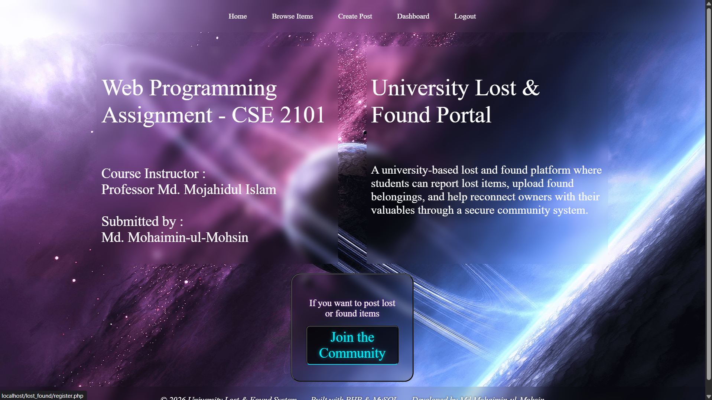
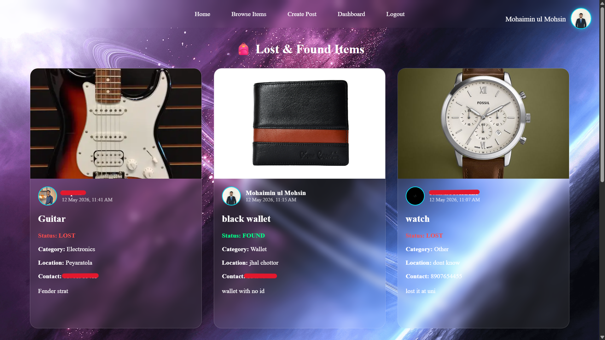
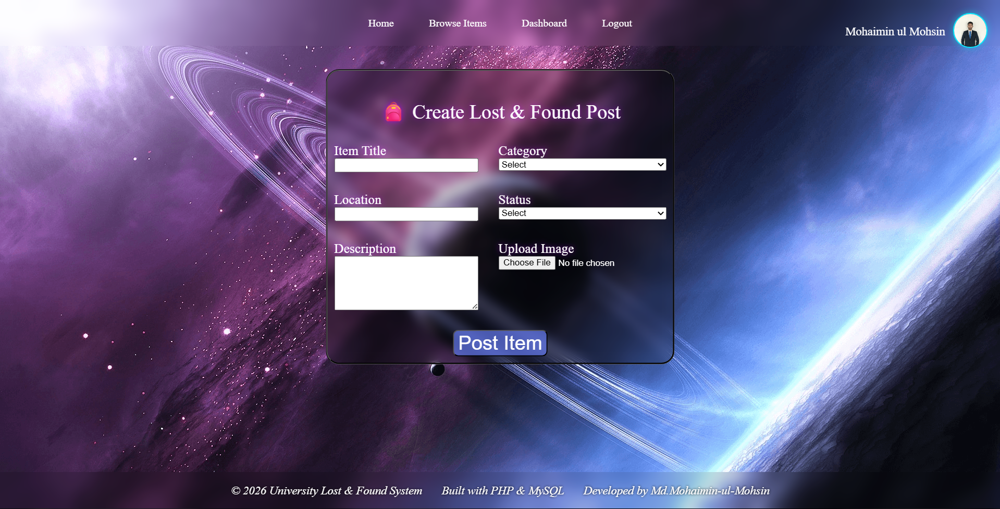
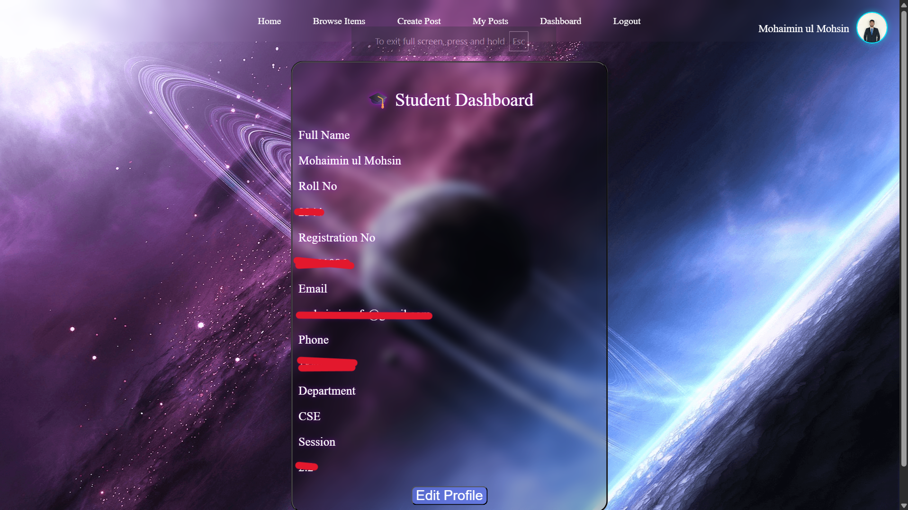

# 🎒 University Lost & Found Platform

A community-driven web platform that helps university students report lost items, post found belongings, and reconnect owners with their valuables.

Built as a Web Engineering course project using PHP, MySQL, HTML, CSS, and JavaScript.

---

## 🚀 Features

### Authentication & User Management

* User Registration
* Secure Login System
* Password Hashing
* Session-Based Authentication
* Logout Functionality
* Profile Management
* Profile Picture Upload

### Lost & Found System

* Create Lost/Found Posts
* Upload Item Images
* Browse Community Posts
* View Poster Information
* Contact Information Display
* Edit Own Posts
* Delete Own Posts

### Security Features

* Password Hashing using `password_hash()`
* Password Verification using `password_verify()`
* Session-Based Access Control
* Ownership Verification for Editing/Deleting Posts

---

## 🛠️ Tech Stack

### Frontend

* HTML5
* CSS3
* JavaScript

### Backend

* PHP

### Database

* MySQL

### Development Environment

* XAMPP

---

## 🗄️ Database Structure

### `student_data`

Stores user information:

| Field       | Description        |
| ----------- | ------------------ |
| id          | User ID            |
| name        | Full Name          |
| email       | Email Address      |
| phone       | Contact Number     |
| dept        | Department         |
| password    | Hashed Password    |
| profile_pic | Profile Image Path |

---

### `lost_found`

Stores lost/found item posts:

| Field       | Description              |
| ----------- | ------------------------ |
| id          | Post ID                  |
| user_id     | Owner of Post            |
| title       | Item Title               |
| description | Item Description         |
| category    | Item Category            |
| location    | Last Seen/Found Location |
| image       | Item Image               |
| status      | Lost or Found            |
| created_at  | Post Creation Time       |

---

## 🔗 Database Relationship

One user can create multiple posts.

```text
student_data.id
        │
        ▼
lost_found.user_id
```

The project uses SQL JOIN queries to combine user information with post information.

---

## 📂 Project Structure

```text
lost_found/
│
├── index.php
├── register.php
├── login.php
├── logout.php
├── dashboard.php
│
├── create_post.php
├── posts.php
├── my_posts.php
├── edit_post.php
├── delete_post.php
│
├── edit_profile.php
├── db.php
│
├── uploads/
│   ├── default.png
│   └── items/
│
├── style.css
│
└── README.md
```

---

## ⚙️ Installation

### 1. Clone Repository

```bash
git clone https://github.com/Naf66/lost_found.git
```

### 2. Move Project

Place the project folder inside:

```text
xampp/htdocs/
```

### 3. Start XAMPP

Start:

* Apache
* MySQL

### 4. Create Database

Create a database:

```sql
lost_found
```

### 5. Import Tables

Import the provided SQL file from db.txt or create the required tables manually.

### 6. Configure Database

Update `db.php`:

```php
$conn = mysqli_connect(
    "localhost",
    "root",
    "",
    "lost_found"
);
```

### 7.Create an upload and item folder

In the main directory create an uploads folder

And also create /uploads/items

### 8.Run Project

Open:

```text
http://localhost/lost_found
```

---

## 📚 Concepts Practiced

This project helped me learn:

* CRUD Operations
* Authentication Systems
* Session Management
* Password Hashing
* Relational Databases
* SQL JOIN Queries
* File Upload Handling
* Dynamic Content Rendering
* User Authorization
* Responsive UI Design

---

## 🔮 Future Improvements

* Search Functionality
* Post Filtering
* Mark Item as Resolved
* Email Notifications
* Admin Dashboard
* Responsive Mobile Design
* Prepared Statements for Improved Security

---

## 👨‍💻 Author

**Md. Mohaimin-ul-Mohsin**

Web Engineering Course Project

GitHub: https://github.com/Naf66

---

## 📄 License

This project was developed for educational purposes.

## 📸 Screenshots

### 🏠 Landing Page



---

### 📋 Browse Posts



---

### ➕ Create Post



---

### 👤 User Dashboard


